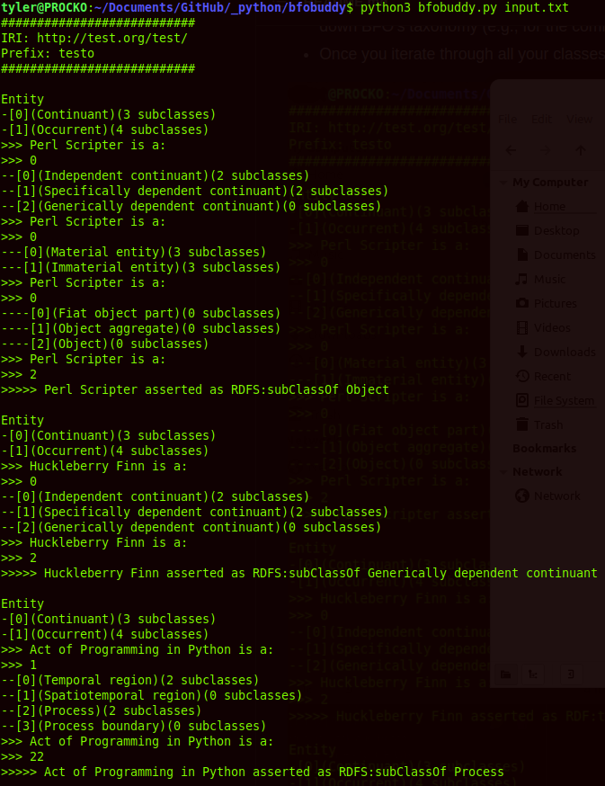

# bfobuddy
A simple command line tool for bootstrapping ontology development with BFO.

Bare minimum command line script for quickly building a BFO-based taxonomy. This script is a proof-of-concept; more functionality to come.

## Use
Download [bfobuddy.py](bfobuddy.py), then call it in command window like:
```
python3 bfobuddy.py [input file location]
```

Example file [input.txt](input.txt) provided.

* Interact by typing the number of the class you want to extend (e.g., 0)
* Type the number twice to assert it as a sibling class (e.g., 00), in cases where you do not want to go further down BFO's taxonomy (e.g., for the commonly-extended class Process)
* Once you iterate through all your classes, a file [out.ttl](out.ttl) is put into the same directory.



# Requirements
* Python 3 
* First line of input file must be your intended IRI (e.g., http://test.org/test/) (do not forget your IRI end delimiter (/ or #))
* Second line of file must be your intended prefix (e.g., testo)
* All other lines in file are class names you want to represent in BFO. Ensure these words only use letters and numbers.

# Limitations
* Cannot currently extend classes you create, only BFO classes. This script is a prototype and will be made better in the future.
